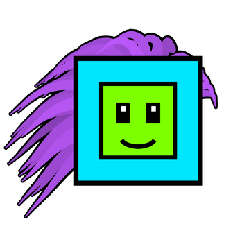

# Icon Mayhem



A [Geode](https://geode-sdk.org) mod for Geometry Dash with cute and crazy customizations for your icons.

## Features

- **Alive**: detailed anime eyes, capes of real cloth, a pet that runs on the blocks with you
- **Physics-based hair** in every game mode: three hairstyles, face locks and bangs, ponytail and twin tails, braids, an ahoge, gusty wind
- **Accessories**: ears, bows, hair clips, a scarf, a headband, flowers, a halo, wings, hats, headphones, glasses, earrings, a cat bell and a little pet with moods
- **Effects**: blush, face stickers, hearts and sparkles, weather (sakura, snow, leaves, stars), a ribbon trail, a sleepy icon, reactions to deaths, checkpoints, level completes, orbs and pads
- **Customizer** with a live icon preview, opened from the pause menu: search, hitbox helpers, undo, random looks and colors
- **Focus mode** for hard levels: what floats around the icon fades in hard parts, nothing covers your view
- **Everywhere**: a look per icon and per game mode, your profile and the main menu, emotes, and other players' looks on Globed (from Globed 2.2.3)
- **Presets**: built-in looks, your own saved looks, sharing through the clipboard or files, looks per game mode and for player 2
- **Social**: the community gallery of looks (share yours, wear and like others'), and on Globed: save, try on and like other players' looks, gift them yours

See [about.md](about.md) for the full description and every setting, and [changelog.md](changelog.md) for what changed.

## Building

You need the [Geode SDK](https://docs.geode-sdk.org/getting-started/) and its CLI.

```sh
geode build
```

Or with CMake directly:

```sh
cmake -B build -G Ninja
cmake --build build
```

The build packages the mod into `build/zhulis.icon-mayhem.geode` and installs it into your Geode profile.

## Project layout

- `src/hair/`: the icon rig
  - `HairSim`: verlet strand simulation, head collider, wind
  - `HairNode`: the rig attached to an icon, hair drawing
  - `Extras.cpp`, `Decor.cpp`, `Charms.cpp`, `Wings.cpp`, `Pet.cpp`, `Effects.cpp`: tails, accessories, headphones / glasses / earrings, wings, the pet, particles and reactions
  - `HairConfig`: settings read from the mod settings
- `src/hooks/`: game hooks (level, garage, pause menu, icon previews, profile and menu, Globed)
- `src/ui/`: the customizer and presets popups
- `src/presets/`: saving, loading and sharing presets, looks per mode and for player 2
- `src/gallery/`: the client of the gallery server, [icon-mayhem-server](https://github.com/ZhulinskiiDanil/icon-mayhem-server) (Express, Postgres; accounts checked with [Argon](https://github.com/GlobedGD/argon))
- `resources/`: sprites and the built-in presets
